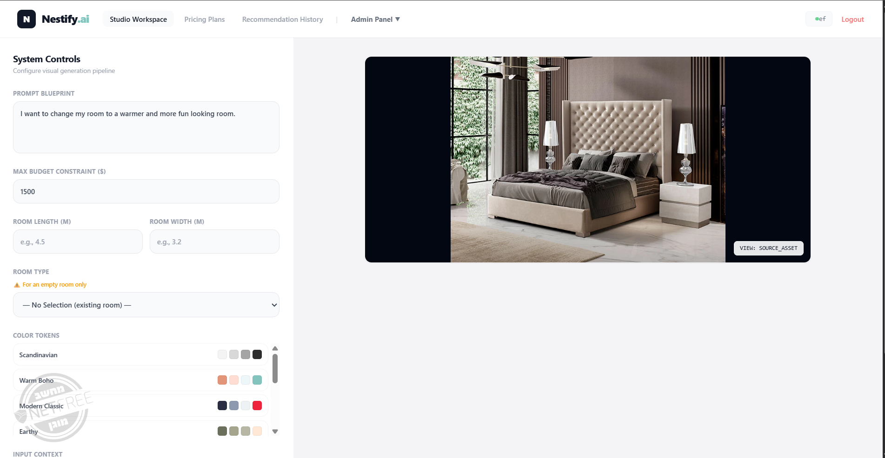
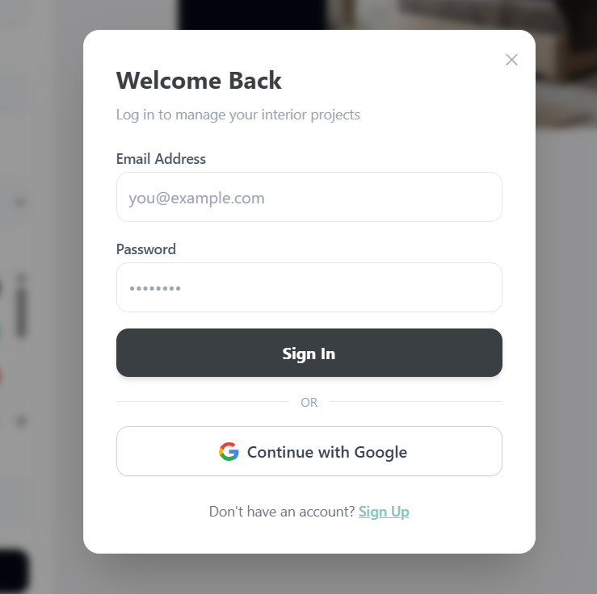
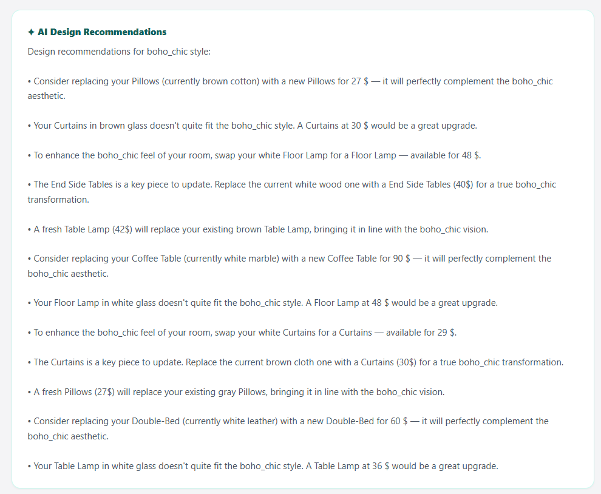
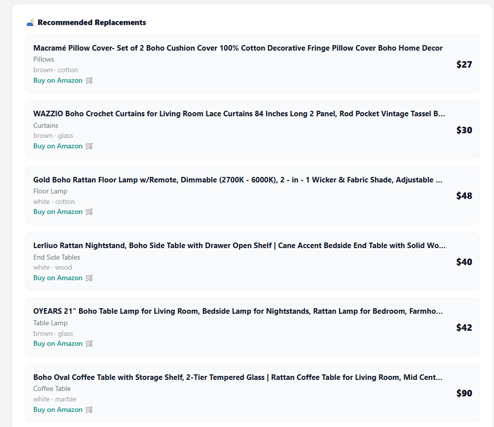

# Nestify.ai

Nestify.ai recommends furniture replacements for a room based on a photo, a text description of the desired style, and a budget. It detects the furniture already in the room, matches it against the target style, and suggests which pieces to replace for the best result within budget — with purchase links included.

## Features

- Automatic furniture detection from an uploaded room photo
- Style classification from a free-text description
- Furniture matching based on color, material, and pattern
- Budget-constrained replacement recommendations
- Purchase links for recommended items
- User accounts with tiered plans (Basic / Pro / Master)
- Scan history
- Admin panel for user management

## Tech Stack

- **Frontend:** React, Tailwind CSS
- **Backend:** C# / ASP.NET Core Web API
- **AI / Model server:** Python, PyTorch, DistilBERT, Faster R-CNN, BLIP, OpenCV
- **Database:** PostgreSQL

## Project Structure

```
Nestify/
├── backend/
│   └── api/
│       ├── Controllers/
│       ├── Data/
│       ├── DTOs/
│       ├── Models/
│       ├── Properties/
│       ├── appsettings.Example.json
│       └── Program.cs
├── ml_service/
│   ├── main.py
│   ├── MyDistilbert.py
│   ├── TrainingModel.py
│   └── design_style_dataset_500.csv
├── frontend/
│   ├── public/
│   ├── src/
│   └── package.json
└── .gitignore
```

## Getting Started

### Prerequisites

- Node.js v18+
- .NET SDK v8+
- Python 3.10+

### Installation

```bash
git clone https://github.com/<your-username>/Nestify.git
cd Nestify

# Backend
cd backend/api
cp appsettings.Example.json appsettings.json   # fill in your DB connection string and API keys
dotnet restore

# Model server
cd ../../ml_service
pip install -r requirements.txt

# Frontend
cd ../frontend
npm install
```

## Usage

Run each service in its own terminal:

```bash
cd backend/api && dotnet run
cd ml_service && python main.py
cd frontend && npm start
```

## Roadmap

- Move API URLs into environment configuration
- Server-side admin authentication
- Support more room types and purchase sources
- Factor room layout into recommendations
- Automated tests
## Screenshots

### Studio Workspace


### Login


### AI Design Recommendations


### Recommended Replacements


## What I Learned

Building Nestify.ai gave me hands-on experience with:

- Designing and integrating a multi-stage AI pipeline (object detection → captioning → language understanding → optimization → generation)
- Training and evaluating real models (Faster R-CNN, DistilBERT) and measuring their performance
- Connecting a Python/PyTorch model-serving layer to a C#/ASP.NET Core backend
- Designing a relational database schema and persistence layer with Entity Framework Core and PostgreSQL
- Integrating multiple external third-party APIs (Amazon/Rainforest, SerpWow) with fallback handling
- Debugging full-stack issues across frontend, backend, and AI service boundaries
- Structuring a real-world project for clarity, documentation, and future maintainability
